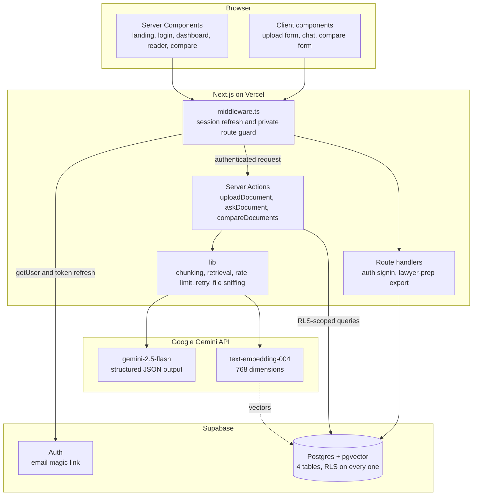
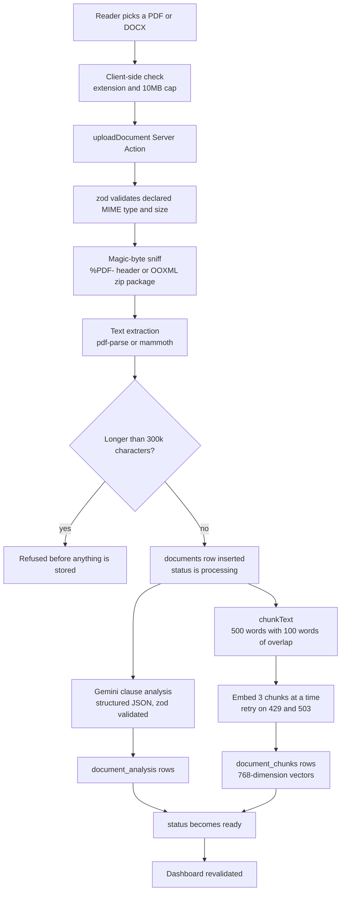
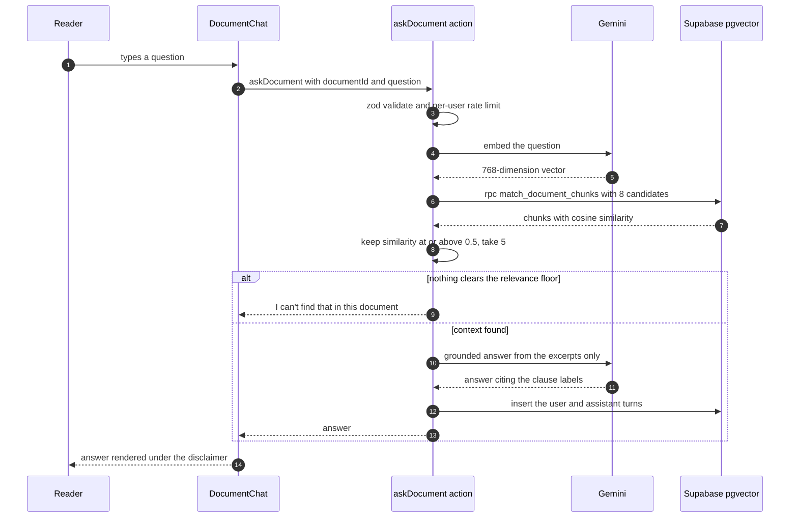
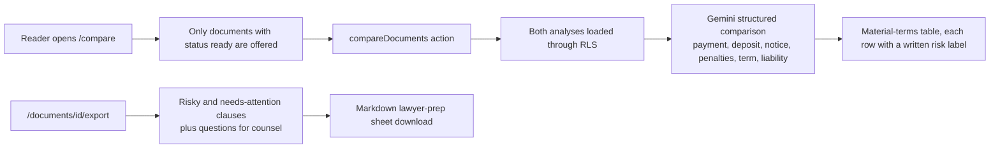
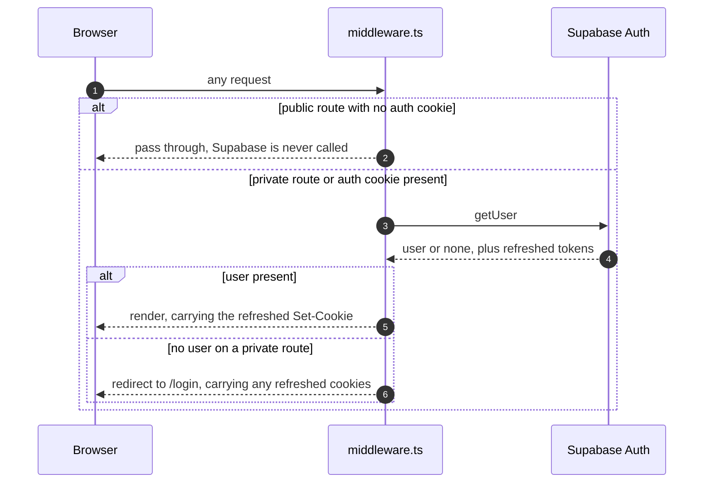
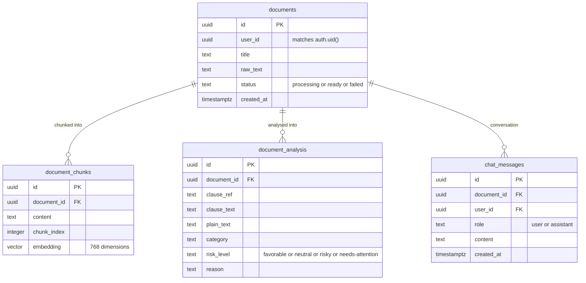
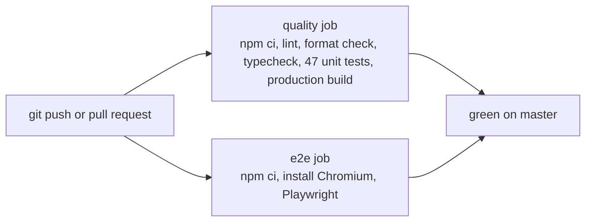

<!--
LexClear — AI for Legal Assistance & Access (PromptWars 2026 submission)
Author: Sabarish R <sabarishr1087@gmail.com>
Portfolio: https://sabarishr08.vercel.app | LinkedIn: https://www.linkedin.com/in/sabarishr08 | GitHub: https://github.com/SabarishR08
Original work by the author. Please do not resubmit it as your own — see LICENSE.
-->

# LexClear — Legal Document Clarity & Access Assistant

[](https://github.com/SabarishR08/lexclear/actions/workflows/ci.yml)
[](LICENSE)

LexClear helps tenants, freelancers and employees understand leases, contracts, offer letters and
NDAs. Upload a PDF or DOCX and it returns plain-language clause explanations, clearly labelled risks
and obligations, grounded document Q&A, a side-by-side comparison of two documents, and a
downloadable lawyer-prep sheet.

> LexClear provides general information, not legal advice. Consult a licensed attorney for your
> specific situation.

## The problem

Ordinary people sign leases, freelance contracts and offer letters they cannot parse, and hiring a
lawyer to read every one is not affordable. The gap is not information — the document is right
there — it is comprehension. LexClear closes that gap without drifting into giving advice: every
answer is grounded in the uploaded text, every risk label carries a written reason, and the tool
refuses to answer when the document does not contain the answer.

## Table of contents

- [Every AI capability and where it plugs in](#every-ai-capability-and-where-it-plugs-in)
- [Architecture](#architecture)
  - [System overview](#system-overview)
  - [Upload and analysis pipeline](#upload-and-analysis-pipeline)
  - [Grounded document Q&A](#grounded-document-qa)
  - [Comparison and lawyer-prep export](#comparison-and-lawyer-prep-export)
  - [Authentication and session handling](#authentication-and-session-handling)
  - [Data model](#data-model)
- [Resilience and cost control](#resilience-and-cost-control)
- [Security and privacy](#security-and-privacy)
- [Accessibility](#accessibility)
- [Testing](#testing)
- [Code quality tooling](#code-quality-tooling)
- [Repository layout](#repository-layout)
- [Local setup](#local-setup)
- [Environment variables](#environment-variables)
- [Known limitations](#known-limitations)
- [Submission links](#submission-links)
- [Four-minute demo script](#four-minute-demo-script)
- [Author](#author)
- [License](#license)

## Every AI capability and where it plugs in

Every AI capability runs on Google Gemini. There is deliberately no fallback provider: embeddings
from a different model live in a different vector space, so swapping one in mid-flight would make
retrieval compare a query vector against incompatible stored vectors and return confident nonsense.

| Service                                            | Integration point                                                                                                                                                                                                                                                                         |
| -------------------------------------------------- | ----------------------------------------------------------------------------------------------------------------------------------------------------------------------------------------------------------------------------------------------------------------------------------------- |
| Gemini `gemini-2.5-flash`, structured JSON output  | **Document Simplification Engine** — rewrites each clause in grade-8 English, tagged by category (Payment, Termination, Liability, Confidentiality, Dispute Resolution…).                                                                                                                 |
| Gemini `gemini-2.5-flash`, `responseSchema` enum   | **Risk & Obligation Highlighter** — classifies each clause `favorable`, `neutral`, `risky` or `needs-attention`, each with a written reason. The label is always rendered as text, never colour alone.                                                                                    |
| Gemini `text-embedding-004` + Supabase `pgvector`  | **Grounded Document Q&A (RAG)** — the document is chunked, embedded into 768-dimension vectors, and the top matches above a relevance floor are retrieved. Answers cite the clauses they came from and the model must say "I can't find that in this document" when the answer is absent. |
| Gemini `gemini-2.5-flash`, structured JSON output  | **Contract Comparison Mode** — pick two analysed documents and Gemini returns a material-terms table: payment/rent, deposit, notice period, penalties, term length and liability, with the practical difference for each.                                                                 |
| Gemini analysis output, rendered deterministically | **Next-Steps & Lawyer-Prep Generator** — the downloadable Markdown sheet gathers the `risky` and `needs-attention` clauses plus questions to bring to counsel. It is assembled from the stored analysis rather than a second model call.                                                  |

Two deliberate constraints apply to every prompt:

1. **Untrusted input is fenced.** Document text is wrapped in `<document>` tags and the prompts state
   that fenced content is data to analyse, never instructions. An uploaded contract is untrusted
   input and can contain text such as "ignore previous instructions".
2. **Model output is validated, not cast.** Every structured response is parsed through a zod schema
   before it reaches the database or the UI, so a malformed or off-schema completion fails loudly
   instead of writing garbage into a clause row.

## Architecture

### System overview



There is no separate REST layer: Server Components read through `lib/`, and mutations go through
Server Actions, which keeps the client bundle small and keeps credentials on the server.

### Upload and analysis pipeline



The parser is chosen from the **sniffed bytes**, not from the client's declared MIME type, so a
renamed `.txt` cannot reach `pdf-parse`. If any Gemini step fails the row is marked `failed` and the
extracted text is kept in `documents.raw_text`.

### Grounded document Q&A



The relevance floor is what makes the refusal honest. Retrieval always returns _something_ — cosine
similarity has no notion of "none of these" — so chunks scoring below 0.5 are discarded and the chat
says the answer is not in the document rather than answering from an unrelated passage.

### Comparison and lawyer-prep export



Comparison reuses the stored `document_analysis` rows rather than re-reading both documents, so it
costs one Gemini call and no re-embedding.

### Authentication and session handling

Server Components cannot write cookies, which makes `middleware.ts` the only place a Supabase session
can actually be refreshed. It therefore runs on **every route except static assets** — scoping it to
the private prefixes would mean a token expiring while the reader sits on the landing page is never
renewed, and their next visit to `/dashboard` bounces them to sign-in.



Anonymous public page loads skip the Supabase round-trip entirely, so the landing page stays cheap.

### Data model



Every table has row-level security scoped to `auth.uid()`, with `document_chunks` and
`document_analysis` authorised through their parent `documents` row. `match_document_chunks` is a
`SECURITY INVOKER` SQL function, so RLS applies to the calling user rather than bypassing it. The full
definition lives in [`supabase/schema.sql`](supabase/schema.sql).

## Resilience and cost control

- Embedding requests run **3 at a time** instead of one per chunk in parallel, so a long contract
  cannot trip its own rate limit.
- Every Gemini call retries on `429`, `500`, `502`, `503` and `504`, honouring the server's own
  `retryDelay` hint where it is present and otherwise backing off exponentially (800ms base, doubled
  per attempt, capped at 15s) with equal jitter so parallel workers do not retry in lockstep. A
  permanent failure such as `400` or `401` is never retried, and neither is a malformed response,
  because repeating those only burns quota.
- Both Gemini-calling Server Actions are also rate-limited per user by an in-memory token bucket.
- A document longer than 300,000 characters is refused before anything is stored, rather than
  silently analysed in part or fanned out into hundreds of embedding requests.
- Comparison and the lawyer-prep sheet reuse stored analysis, so neither re-reads or re-embeds a
  document.

## Security and privacy

- Row-level security on every table, scoped to `auth.uid()`; the service-role key never reaches the
  browser and in fact is not used anywhere in the codebase.
- `middleware.ts` refreshes the Supabase session and redirects anonymous visitors away from
  `/dashboard`, `/documents/*` and `/compare`.
- Uploads are validated twice: zod checks the declared type and the 10MB cap, then the raw bytes are
  sniffed for a real PDF header or an OOXML zip package, so a renamed file cannot reach a parser.
- Document text is fenced as untrusted data in every prompt, which hardens against prompt injection
  carried inside an uploaded contract.
- Security headers (`nosniff`, `X-Frame-Options`, `Referrer-Policy`, `Permissions-Policy`) are set in
  `next.config.ts`.
- Document text is disclosed as being sent to Gemini before upload, and `.env` is gitignored. Only
  `.env.example` is committed.

## Accessibility

- `axe-core` runs inside the Playwright suite in CI against the landing and login pages. It caught a
  real AA violation during development: the wordmark accent was 2.88:1 against the page background,
  below the 3:1 floor for large text, and was darkened until it cleared AA for normal text as well.
- The file input is visually hidden rather than `display: none`, so it stays in the tab order — the
  primary action of the app was previously unreachable by keyboard.
- A skip link jumps straight to main content, and focus is always visible via `:focus-visible`.
- Risk states are written out as text as well as colour, and async results announce themselves
  through `role="status"` / `aria-live`.
- Every form control has a programmatic label, and the comparison table uses real table semantics
  with `caption` and `scope`.

## Testing

```bash
npm test          # Vitest unit suites (47 tests)
npm run test:e2e  # Playwright: accessibility, route protection, upload failure paths
```

Unit coverage: chunking and the index-size guard, model-output validation, relevance selection,
magic-byte detection, retry classification and backoff (including the server hint and the delay cap),
the rate-limit bucket, bounded-concurrency mapping and the upload/chat/compare schemas.

The Playwright suite covers axe-core scans, the disclosure banner, the skip link, and route
protection. Four further specs drive the signed-in upload flow — keyboard reaching the file input, a
plain text file, a file that only claims to be a PDF, and an oversized file. They are skipped unless
a signed-in session is provided, because a magic link cannot be completed from a headless test:

```bash
E2E_SUPABASE_COOKIE_NAME=sb-<project-ref>-auth-token \
E2E_SUPABASE_COOKIE_VALUE=<cookie value> \
npm run test:e2e
```

### Continuous integration



## Code quality tooling

```bash
npm run lint          # ESLint flat config (next/core-web-vitals + next/typescript)
npm run format        # Prettier
npm run format:check  # CI formatting gate
npm run typecheck     # tsc --noEmit, strict
```

The project is TypeScript in strict mode throughout. Lint and formatting are both enforced in CI, not
just available locally.

## Repository layout

```text
app/                  routes, Server Actions and route handlers
  dashboard/          library, upload action
  documents/[id]/     clause reader, chat action, lawyer-prep export
  compare/            comparison page and action
components/           shared UI: disclaimer, risk badge, upload form, chat, compare form
lib/ai/               Gemini calls, retry policy, zod validation of model output
lib/                  chunking, retrieval, upload sniffing, rate limiting, data access, auth
e2e/                  Playwright specs
supabase/             schema.sql: tables, RLS policies, match_document_chunks
middleware.ts         Supabase session refresh and private route guard
```

## Local setup

1. Copy `.env.example` to `.env.local` and set the credentials below.
2. Create a Supabase project, enable the `vector` extension, and run
   [`supabase/schema.sql`](supabase/schema.sql).
3. Enable email magic-link auth (and Google OAuth if you want it) in Supabase.
4. Run `npm install`, then `npm run dev`.

## Environment variables

| Variable                        | Required | Purpose                                |
| ------------------------------- | -------- | -------------------------------------- |
| `NEXT_PUBLIC_SUPABASE_URL`      | yes      | Supabase project URL                   |
| `NEXT_PUBLIC_SUPABASE_ANON_KEY` | yes      | Public anon key, RLS enforced          |
| `GEMINI_API_KEY`                | yes      | Every Gemini call                      |
| `SUPABASE_SERVICE_ROLE_KEY`     | no       | Reserved; never sent to the client     |
| `E2E_SUPABASE_COOKIE_NAME`      | no       | Enables the signed-in Playwright specs |
| `E2E_SUPABASE_COOKIE_VALUE`     | no       | Enables the signed-in Playwright specs |

Without the Supabase variables the app still builds and runs, showing a "not configured" notice in
place of the upload form instead of throwing a 500.

## Known limitations

- Comparison Mode needs two documents whose analysis has finished, so upload both before comparing.
- A failed analysis leaves the extracted text in `documents.raw_text` but there is no retry button
  yet; re-uploading re-embeds from scratch (no embedding cache).
- Answers stream only after completion; responses are not token-streamed.
- The lawyer-prep sheet is assembled from the stored analysis instead of a second Gemini call.
- Clause analysis reads only the first 45,000 characters of a document. The brief calls for "one
  structured-output call per clause batch", so a long document currently gets its later clauses
  indexed for Q&A but not explained in the clause guide.
- The relevance floor of 0.5 is a considered default, not a tuned value; it has not been calibrated
  against a labelled set of real lease questions.

## Submission links

- Deployed prototype: add Vercel URL here
- Demo video: add link here

## Four-minute demo script

- **0:00–0:20:** "LexClear makes legal documents clearer; it provides general information, not legal
  advice." Point at the persistent banner above every page.
- **0:20–0:55:** Sign in and upload a small lease PDF live. Point out the 10MB cap, the PDF/DOCX
  check, and the notice that text is sent to Gemini.
- **0:55–1:35:** Open the finished document. Show original clause text beside grade-8 language with
  the category, the written risk label and the reason. Say that Gemini structured JSON powers it and
  that the response is zod-validated before it is stored.
- **1:35–2:15:** Type a live question such as "How much notice do I need to give?" Show the cited
  answer, and explain that pgvector retrieves only this document's strongest passages before Gemini
  answers. Ask something that is not in the document to show it refusing.
- **2:15–2:50:** Open Compare documents, pick two leases, and walk the material-terms table (rent,
  deposit, notice, penalties). This is a second Gemini structured-output call.
- **2:50–3:20:** Download the lawyer prep sheet: flagged clauses plus questions to bring to counsel.
- **3:20–4:00:** Close on the engineering: RLS on every table, rate limiting and byte-level upload
  checks, `axe-core` accessibility checks plus keyboard support in CI, and a clear boundary —
  LexClear assists users, it never replaces a licensed lawyer.

## Author

Built by **Sabarish R**.

|           |                                           |
| --------- | ----------------------------------------- |
| Email     | <sabarishr1087@gmail.com>                 |
| Portfolio | <https://sabarishr08.vercel.app>          |
| LinkedIn  | <https://www.linkedin.com/in/sabarishr08> |
| GitHub    | <https://github.com/SabarishR08>          |

Every source file in this repository carries the same attribution in its header comment. Note that
comments can be stripped in seconds — the MIT licence below is the part with legal force, and it
requires anyone reusing this code to keep the copyright notice.

## License

[MIT](LICENSE) © 2026 Sabarish R. The licence covers this code, not legal advice of any kind —
LexClear ships no lawyer-client relationship.
